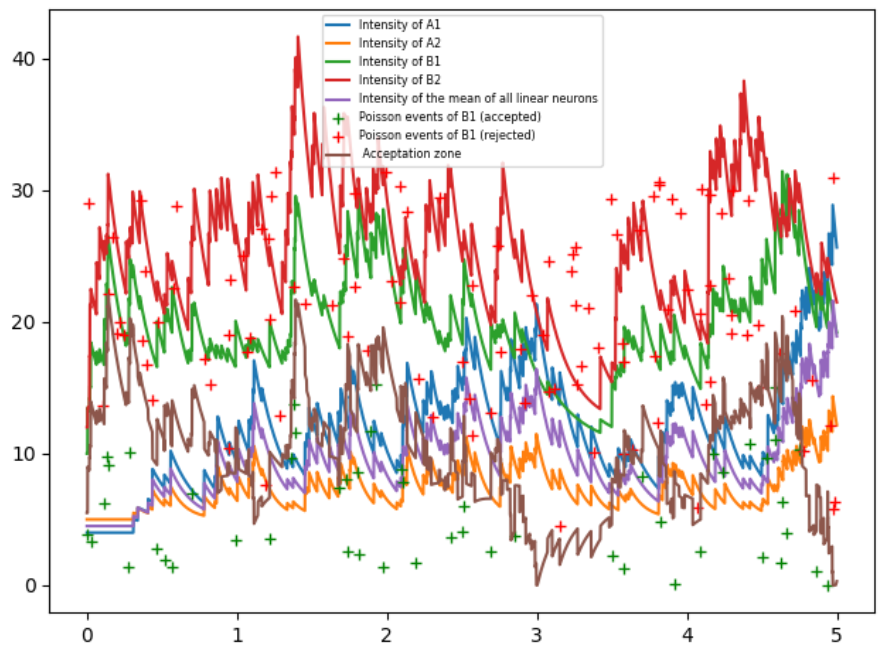

# Introduction to StochSimul

This repository was being developed as an internship project by Eduardo de Jesus Zancanaro Garcia at the Institut de Mathématiques de Toulouse and at the Institut National des Sciences Appliquées de Toulouse. It is the follow up to another project developped during a previous internship that was not documented on GitHub. Not all its code has been integrated into this project, but some of it has.

The code is tested with pytest, and all files that end in "_test.py" are test files for files whose name is the exact same (except for the suffix "_test"). These tests are not exhaustive but they serve as a first safeguard against non-functioning code. Currently two test functions fail, see why below.

The code is structured as follows:
- basicfunctions.py : contains some basic functions called by other files.
- new_model: defines the functions needed to simulate the new semi-linear model developped in the article.
- new_model_fast: same as new_model but uses methods that are faster in the case of an exponential decay kernel. In the current version (28/10/2025), the test file for this fails because it turns out to be slower than the original one. See the GitHub Issue for more information. It could be fixed by repackaging the kernel functions as objects whose attributes are their parameters. The functionality of the code is nonetheless uncompromised.
- SimpleNeuronSim: deprecated. Use MultipleNeuronSim
- MultipleNeuronSim: The main file to be executed. Here, neuron objects can be created and all parameters (initial intensity, kernel function, time duration of the simulation, upper bound of the intensity for the sake of the simulation) can be fixed. Multiple plotting functions are defined to understand the thinning procedure used.
- generate_statistics_on_neurons: Untested generic simulation file, that builds a text file "results.txt" in the csv format. This file can be adapted to analyse varying statistic properties of the simulated system. As an example, the explosion or non explosion of the system as a function of the parameters was included, but other variables to be predicted could be tested.

# Using MultipleNeuron.py
At the end of the file, you can see an example of a simulation of system of neurons.

You can create a neuron by either calling the NeuronLinear or NeuronSemilinear classes. *Only after creating all neurons should you call the .events() method to simulate them.* You should also call NeuronLinear.events() *before* NeuronSemilinear.events().
Plotting of the intensity as a function of time is done by the intensity_plot() method. If you want to plot the Poisson points used to generate one of the semilinear models, you can use the plot_poisson_events() method (it is only implemented for semilinear neurons). Doing so for multiple semilinear neurons will make the plot unreadable.

Below is an example of a (heavily loaded) plot. We used the parameters present in the main of MultipleNeuronSim.py.

If you want to reinitialise the system it is mandatory to call the static methods reinitialise() for both the linear (NeuronLinear.reinitialise())and semilinear (NeuronSemilinear.reinitialise()) neurons. Otherwise an assertion error will occur when calling events(). This is because we use global static variables to access information of other neurons, so they need to be properly reset to their original values before a second simulation is launched.

